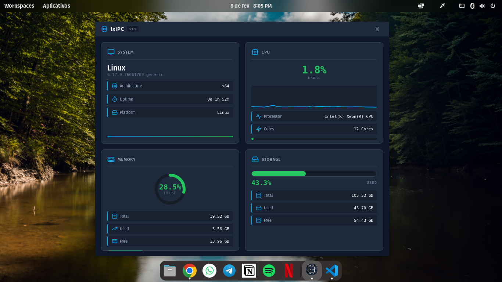
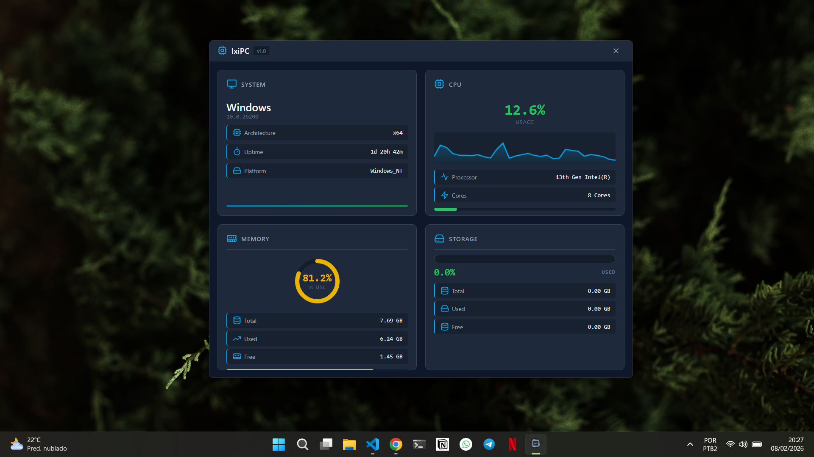

# IxiPC

Aplicação desktop multiplataforma para **monitoramento de informações do sistema**, construída com **Electron + React + TypeScript**.

Exibe, em tempo real, dados essenciais do computador como **CPU, memória, disco e sistema operacional**, com simplicidade, desempenho e interface limpa.

---

## 📸 Screenshots

### Linux



### Windows

## 

## ✨ Funcionalidades

- Informações do sistema operacional (SO, versão, arquitetura, uptime)
- Dados da CPU (modelo, núcleos e uso em tempo real)
- Monitoramento de memória (total, usada, livre e percentual)
- Informações de disco:
  - Espaço total, usado e livre
  - Percentual de uso
  - Leitura básica de saúde do disco (SMART, quando disponível)

- Interface moderna e leve
- Funciona em **Linux, Windows e macOS**

---

## 🧱 Stack Tecnológica

- **Electron** — aplicação desktop
- **React** — interface
- **TypeScript** — tipagem e segurança
- **Vite** — build e dev server
- **CSS Modules** — escopo de estilos
- **Node.js APIs** — coleta de dados do sistema

---

## 📂 Estrutura do Projeto

```bash
IxiPC/
├── electron/          # Processo principal e preload
│   ├── main.ts
│   └── preload.ts
├── public/            # Assets públicos (ícone, etc)
├── src/               # Interface React
│   ├── components/
│   ├── App.tsx
│   └── main.tsx
├── index.html
├── vite.config.ts
├── electron-builder.json5
└── package.json
```

---

## ▶️ Como executar o projeto

### Pré-requisitos

- Node.js 18+
- npm ou pnpm

### Instalação

```bash
npm install
```

### Modo desenvolvimento

```bash
npm run dev
```

Isso inicia:

- Vite (frontend)
- Electron (aplicação desktop)

---

## 📦 Build da aplicação

Para gerar o build desktop:

```bash
npm run build
```

O empacotamento é feito com **electron-builder**, gerando executáveis conforme o sistema operacional.

---

## 🖥️ Observações técnicas

- A aplicação utiliza **IPC seguro** (`contextIsolation: true`)
- Não há `nodeIntegration` no renderer
- Leitura de saúde do disco depende de ferramentas do sistema (ex: `smartctl` no Linux)
- Em janelas sem frame (`frame: false`), o ícone não aparece na barra de título — comportamento esperado do Electron

---

## 🎯 Objetivo do projeto

Criado como um projeto de estudo e prática para:

- Electron
- Comunicação segura entre processos
- Monitoramento de sistema multiplataforma
- Organização de código e arquitetura limpa

---

## 👤 Autor

[](https://github.com/joaomjbraga)

---

Se você achou o projeto útil, deixe uma ⭐ no repositório.

## 📄 Licença

Este projeto está licenciado sob a licença **MIT**.
